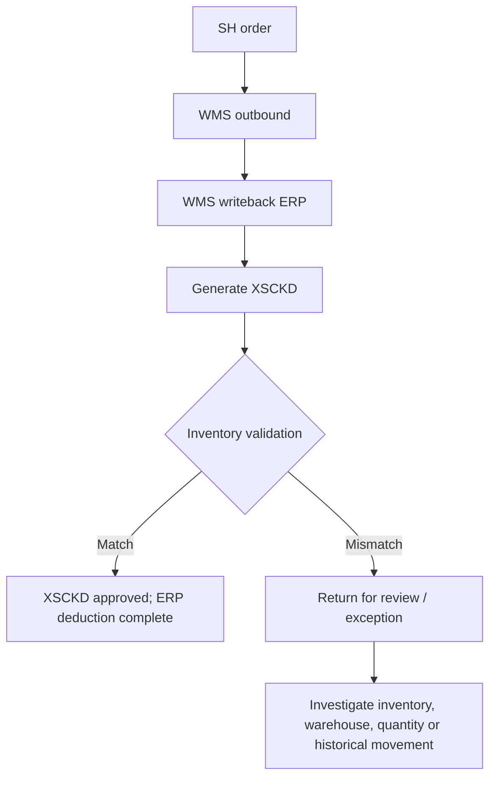

# ERP XSCKD Logic

```mermaid
flowchart TD
    A[SH order] --> B[WMS outbound]
    B --> C[WMS writeback ERP]
    C --> D[Generate XSCKD]
    D --> E{Inventory validation}
    E -->|Match| F[XSCKD approved; ERP deduction complete]
    E -->|Mismatch| G[Return for review / exception]
    G --> H[Investigate inventory, warehouse, quantity or historical movement]
```

FHTZD remains the intermediate investigation reference.

