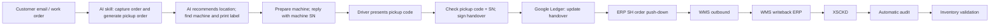

# Outbound Flow

```mermaid
flowchart LR
    A[Customer email / work order] --> B[AI skill: capture order and generate pickup order]
    B --> C[AI recommends location; find machine and print label]
    C --> D[Prepare machine; reply with machine SN]
    D --> E[Driver presents pickup code]
    E --> F[Check pickup code + SN; sign handover]
    F --> G[Google Ledger: update handover]
    G --> H[ERP SH order push-down]
    H --> I[WMS outbound]
    I --> J[WMS writeback ERP]
    J --> K[XSCKD]
    K --> L[Automatic audit]
    L --> M[Inventory validation]
```

The supplied attachment truncates its original Mermaid source after WMS writeback; K–M are taken from the separately supplied current ERP rule.

